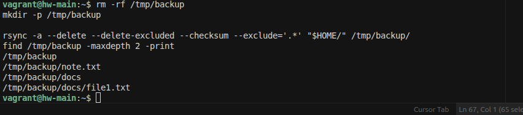
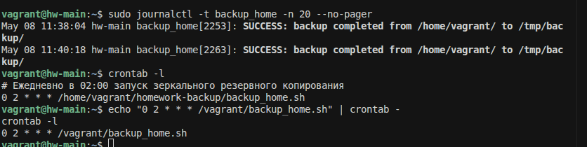

# Домашнее задание: «Резервное копирование»

## Задание 1

Команда для зеркальной копии домашней директории в `/tmp/backup`:

```bash
rsync -a --delete --delete-excluded --checksum --exclude='.*' "$HOME/" /tmp/backup/
```

Проверка результата:

```bash
find /tmp/backup -maxdepth 2 -print
```

скриншот:
- команда `rsync`;
- результат выполнения.


## Задание 2

В проекте:
- `backup_home.sh` — скрипт резервного копирования;
- `crontab.txt` — пример записи для cron.

Скрипт запускает зеркальный бэкап в `/tmp/backup` и пишет статус в системный лог через `logger` (`SUCCESS`/`ERROR`).

### Настройка

```bash
chmod +x /vagrant/backup_home.sh
echo "0 2 * * * /vagrant/backup_home.sh" | crontab -
crontab -l
```

### Проверка

```bash
/vagrant/backup_home.sh
sudo journalctl -t backup_home -n 20 --no-pager
```

## Что приложить на проверку
- скрипт
[text](backup_home.sh)
- скриншот вывода `crontab -l` и системного лога с записью `backup_home: SUCCESS` (или `ERROR`).

